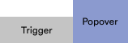
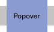

<hr>
<div align="center">
  <h1 align="center">
    &lt;Popover&gt;
  </h1>
</div>

<p align="center">
  <a href="https://bundlephobia.com/result?p=@accessible/popover">
    
  </a>
  <a aria-label="Types" href="https://www.npmjs.com/package/@accessible/popover">
    
  </a>
  <a aria-label="Code coverage report" href="https://codecov.io/gh/accessible-ui/popover">
    
  </a>
  <a aria-label="Build status" href="https://travis-ci.org/accessible-ui/popover">
    
  </a>
  <a aria-label="NPM version" href="https://www.npmjs.com/package/@accessible/popover">
    
  </a>
  <a aria-label="License" href="https://jaredlunde.mit-license.org/">
    
  </a>
</p>

<pre align="center">npm i @accessible/popover</pre>
<hr>

An accessible, "batteries included", popover component for React.

## Features

- **Several placement options** You can render the popover anywhere! Top, top-left, bottom, center, inside, outside,
  literally anywhere!
- **Containment policies** The popover is configured to contain itself inside the window using
  a containment policy. It's also optional, so you can turn it off.
- **Auto-repositioning** Use the props `repositionOnScroll` or `repositionOnResize` to reposition
  the popover automatically when the scroll position or size of the window changes.
- **Style-agnostic** You can use this component with the styling library of your choice. It
  works with CSS-in-JS, SASS, plain CSS, plain `style` objects, anything!
- **Portal-friendly** The popover will render into React portals of your choice when configured
  to do so.
- **a11y/aria-compliant** This component works with screen readers out of the box and manages
  focus for you.

## Quick Start

[Check out the example on CodeSandbox](https://codesandbox.io/s/accessiblepopover-example-6l3u0)

```jsx harmony
import {Popover, PopoverBox, PopoverMe} from '@accessible/popover'

const Component = () => (
  <Popover repositionOnScroll repositionOnResize>
    <PopoverBox placement="bottomLeft">
      <div className="my-popover">Hello world</div>
    </PopoverBox>

    <PopoverMe on="hover">
      <a href="/profile/me">
        
      </a>
    </PopoverMe>
  </Popover>
)
```

## API

### Jump to

- [`<Popover>`](#popover)
- [`<PopoverBox>`](#popoverbox)
- [`<PopoverMe>`](#popoverme)
- [`usePopover`](#usepopover)
- [`useControls`](#usecontrols)
- [`usePlacement`](#useplacement)
- [`useIsOpen`](#useisopen)

### `<Popover>`

This component creates the context for your popover box and trigger and contains some
configuration options.

#### Props

| Prop               | Type                              | Default     | Required? | Description                                                                                                                                                                                                                                                               |
| ------------------ | --------------------------------- | ----------- | --------- | ------------------------------------------------------------------------------------------------------------------------------------------------------------------------------------------------------------------------------------------------------------------------- |
| defaultOpen        | `boolean`                         | `true`      | No        | This sets the default open state of the popover. By default the popover is closed.                                                                                                                                                                                        |
| open               | `boolean`                         | `undefined` | No        | You can control the open/closed state of the popover with this prop. When it isn't undefined, this value will take precedence over any calls to `open()`, `close()`, or `toggle()`.                                                                                       |
| repositionOnResize | `boolean`                         | `false`     | No        | Setting this to `true` will update the position of the popover when the window's dimensions change and the popover is currently open.                                                                                                                                     |
| repositionOnScroll | `boolean`                         | `false`     | No        | Setting this to `true` will update the position of the popover when the window's scroll position changes and the popover is currently open.                                                                                                                               |
| containPolicy      | [`ContainPolicy`](#containpolicy) | `"flip"`    | No        | This tells the popover what to do when it overflows outside the dimensions of the window. By default it will flip its position on both the `x` and `y` axis to attempt to remain within the bounds of the window. See [`ContainPolicy`](#containpolicy) for more options. |
| id                 | `string`                          | `undefined` | No        | By default this component creates a unique id for you, as it is required for certain aria attributes. Supplying an id here overrides the auto id feature.                                                                                                                 |

#### `ContainPolicy`

| Policy     | Description                                                                                                                                                                                                                                                                                                                                                                                      |
| ---------- | ------------------------------------------------------------------------------------------------------------------------------------------------------------------------------------------------------------------------------------------------------------------------------------------------------------------------------------------------------------------------------------------------ |
| `"flip"`   | This will attempt to flip its position on both the `x` and `y` axis to attempt to remain within the bounds of the window.                                                                                                                                                                                                                                                                        |
| `"flipX"`  | This will attempt to flip its position on only the `x` axis to attempt to remain within the bounds of the window.                                                                                                                                                                                                                                                                                |
| `"flipY"`  | This will attempt to flip its position on only the `y` axis to attempt to remain within the bounds of the window.                                                                                                                                                                                                                                                                                |
| `function` | You can decide what to do with the popover on your own by providing a callback with the signature <code>(placement: string, triggerRect: ClientRect, popoverRect: ClientRect) => Placement &#124; PlacementResult</code> where [`Placement`](#placement) is a string returning an alternative placement and `PlacementResult` is an object shaped `{placement: Placement, style: CSSProperties}` |

### `<PopoverBox>`

This component wraps any React element and turns it into a popover box.

#### Props

| Prop            | Type                                       | Default           | Required? | Description                                                                                                                                                                                                      |
| --------------- | ------------------------------------------ | ----------------- | --------- | ---------------------------------------------------------------------------------------------------------------------------------------------------------------------------------------------------------------- |
| placement       | [`Placement`](#placement)                  | `"bottom"`        | No        | This tells the box where it should render relative to its triggering element.                                                                                                                                    |
| portal          | <code>boolean &#124; &#124; string </code> | `false`           | No        | When `true` this will render the popover into a React portal with the id `#portals`. You can render it into any portal by providing its query selector here, e.g. `#foobar`, `[data-portal=true]`, or `.foobar`. |
| closeOnEscape   | `boolean`                                  | `true`            | No        | By default the popover will close when the `Escape` key is pressed. You can turn this off by providing `false` here.                                                                                             |
| closedClassName | `string`                                   | `undefined`       | No        | This class name will be applied to the child element when the popover is `closed`.                                                                                                                               |
| openClassName   | `string`                                   | `"popover--open"` | No        | This class name will be applied to the child element when the popover is `open`.                                                                                                                                 |
| closedStyle     | `React.CSSProperties`                      | `undefined`       | No        | These styles will be applied to the child element when the popover is `closed` in addition to the default styles that set the box's visibility.                                                                  |
| openStyle       | `React.CSSProperties`                      | `undefined`       | No        | These styles name will be applied to the child element when the popover is `open` in addition to the default styles that set the box's visibility.                                                               |

#### Placement

These are the default placements allowed by the popover relative to its triggering element

| Placement        | Description                                      |
| ---------------- | ------------------------------------------------ |
| top              |                            |
| topLeft          |                    |
| topRight         |                  |
| right            |                        |
| rightTop         |                  |
| rightBottom      |            |
| bottom           |                      |
| bottomLeft       |              |
| bottomRight      |            |
| left             |                          |
| leftTop          |                    |
| leftBottom       |              |
| innerTop         |                  |
| innerTopLeft     |          |
| innerTopRight    |        |
| innerRight       |              |
| innerBottom      |            |
| innerBottomLeft  |    |
| innerBottomRight |  |
| innerLeft        |                |
| center           |                      |

#### Example

```jsx harmony
<PopoverBox placement="innerTopLeft">
  <div className="menu">Menu</div>
</PopoverBox>

// <div
//   class="menu"
//   aria-hidden="true"
//   aria-modal="false"
//   id="popover--foobar"
//   role="dialog"
//   style="position: fixed; visibility: hidden; right: 1024px; top: 0px;"
// >
//   Menu
// </div>
```

### `<PopoverMe>`

This component wraps any React element and turns it into a popover trigger.

#### Props

| Prop     | Type                                                | Default     | Required? | Description                                                                                                                                                                                                                                                     |
| -------- | --------------------------------------------------- | ----------- | --------- | --------------------------------------------------------------------------------------------------------------------------------------------------------------------------------------------------------------------------------------------------------------- |
| on       | <code>"hover" &#124; "click" &#124; "focus" </code> | `undefined` | Yes       | `"hover"` causes the popover to open on `mouseenter` and close on `mouseleave`. `"click"` causes the popover to toggle its visibility each `click` event. `"focus"` causes the popover to open when the child element is focused while nothing happens on blur. |
| children | `React.ReactElement`                                | `undefined` | Yes       | The child is cloned by this component and has aria attributes injected into its props as well as the events defined above.                                                                                                                                      |

#### Example

```jsx harmony
<PopoverMe on="click">
  <button className="my-button">Popover me!</button>
</PopoverMe>

// <button
//   class="my-button"
//   aria-controls="popover--12"
//   aria-haspopup="dialog"
//   aria-expanded="false"
// >
//   Popover me!
// </button>
```

### `usePopover()`

This hook provides the value of the popover's [PopoverContextValue object](#popovercontext)

#### Example

```jsx harmony
const Component = () => {
  const {open, close, toggle, isOpen} = usePopover()
  return <button onClick={toggle}>Toggle the popover</button>
}
```

### `PopoverContextValue`

```typescript
interface PopoverContextValue {
  // `true` when the popover is open and visible
  // `false` when closed
  isOpen: boolean
  // opens the popover
  open: () => void
  // closes the popover
  close: () => void
  // toggles the popover between open/closed states
  toggle: () => void
  // calling this forces the popover to reposition
  // itself to the specified placement
  reposition: (nextPlacement: Placement) => void
  // the ID of the popover box
  id: string
  // the style applied to the popover box
  style: React.CSSProperties
  // the rendered placement of the popover
  placement: Placement
  // sets the ref for the popover box
  ref: React.MutableRefObject<HTMLElement | null>
  // sets the ref for the triggering element
  triggerRef: React.MutableRefObject<HTMLElement | null>
  // this describes the events that cause the popover
  // to open
  triggeredBy: string | null
  // sets the `triggeredBy` variable above
  setTriggeredBy: (trigger: string) => void
}
```

### `usePlacement()`

This hook provides access to the popover's rendered placement

#### Example

```jsx harmony
const Component = () => {
  const placement = usePlacement()
  return (
    <PopoverBox placement="top">
      <div className='my-popover'>
        <span className={`arrow--${placement}`} />
      </div>
    </PopoverBox>
  )
}
```

### `useControls()`

This hook provides access to the popover's `open`, `close`, and `toggle` functions

#### Example

```jsx harmony
const Component = () => {
  const {open, close, toggle} = useControls()
  return (
    <PopoverBox>
      <div className='my-popover'>
        <button onClick={close}>Close me</button>
      </div>
    </PopoverBox>
  ) 
}
```

### `useIsOpen()`

This hook provides access to the popover's `isOpen` value

#### Example

```jsx harmony
const Component = () => {
  const isOpen = useIsOpen()
  return (
    <PopoverBox>
      <div className='my-popover'>
        Am I open? {isOpen ? 'Yes' : 'No'}
      </div>
    </PopoverBox>
  ) 
}
```

## LICENSE

MIT
